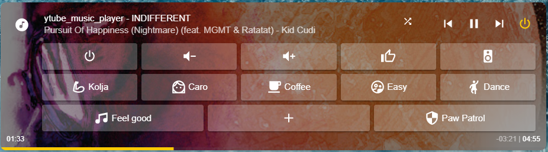

# yTube Music Player
[](https://github.com/hacs/integration)



The purpose of this integration is to provide easy access to media (Tracks/Playlists/Albums) of your YouTube Music premium subscription. The integration will let you login to your account and present you a [GUI](media_browser.png) similar to the YouTube website, where you can select your playlist/album/.. but in HomeAssistant, actually in the "Media Browser" of HomeAssistant.  

Once you've selected what you want to listen (e.g. a Playlist) it will grab the YouTube ID (everything has unique IDs at YouTube) decode it to a streaming URL and forward that URL to a HomeAssistant media_player of your choice, the "remote_player". This works great in combination with Google Chromecasts but other media_player might work as well, as long as they can stream from a URL (the Alexa integration can't do this to my knowledge).

Media_player in Homeassistant are not designed to play multiple tracks, so the playback on the remote_player will usually just stop, once it reaches the end of the track. We as user often don't want that. We want to listen to a complete album or a playlist with multiple tracks. Hence this integration will buffer the playlist and supervise the status of the remote_player. Once it detects that the playback stopped it will start the next track of the playback ... so this integration is kind of a DJ, always making sure that you're entertained. :)

This integration will show up in homeassistant as media_player + (optional) sensor. The media_player itself is required to offer the media_browser dialog, the sensor will provide extra information like the buffered playlist.


## Features
- Browse through all you library tracks / artists / playlists showing names and covers of the media
- Either plays straight from the playlist or creates a radio based on the playlist
- Forwards the streaming data to any generic mediaplayer
- Keeps auto_playing as long as it is turned on
- On the fly change of the remove_player (playlist will stay the same, and position in track will be submitted to next player)

# Support
If you like what I've done and you want to help: buy me a coffee/beer. Thanks! 

[](https://www.buymeacoffee.com/KoljaWindeler)

# Overview / Step - by - step guide

1. Initial setup: [Videotutorial](https://www.youtube.com/watch?v=_UQv7fc3h5s)
- (required) install the component via HACS [see Installation](#installation-via-hacs)
- (required) configure the component via config flow, see details for the [see Setup](#setup)

you can now use it via the media browser and the default mediaplayer card, but please read on ... 

2. Mini-media-player [Videotutorial](https://www.youtube.com/watch?v=YccSsBr3Tag)
- (highly recommended) install the mini-media-player and use [see shortcut buttons](#shortcuts) 
3. (optional for mpd / sonos) install the automation to fix [see auto-advancing](#mpd-fix)
4. (optional) install [automations](#Automations)

if you find a bug, or want some extra informations

6. (debug) enable [debug info](#debug-information)

## Installation via HACS

Please install this custom component via [HACS](https://hacs.xyz/docs/installation/prerequisites).

Once you've installed HACS follow this [Guide](https://codingcyclist.medium.com/how-to-install-any-custom-component-from-github-in-less-than-5-minutes-ad84e6dc56ff) and install the yTube_music_player from the default HACS repository.

# Setup
**Please use the config flow of Home Assistant**
1. Go to Settings -> Devices -> "Add integration" -> "YouTube Music Player"
   1. If the integration didn't show up in the list please REFRESH the page
2. The integration will interact with the YouTube Music server via Googles oAuth method. You have to grand access for that. Copy the shown URL to a separate browser window and follow the instructions on the screen.
3. On the second page you can configure the name of the player (handy if you want multiple players), define the default "remote player" and the oAuth file location (also needed if you want multiple player)
4. The last (and optional) page shows several entity_ids for dropdown field. You can leave the default values, even if you don't want to use those field and don't add them to your configuration... or clear the field ... both will work fine (see [below](https://github.com/KoljaWindeler/ytube_music_player#dropdowns-buttons-and-marksdowns))

## Installation went fine, what now?
At this point you should have a new entity called `media_player.ytube_music_player` (or similar if you've changed the name). Open the media_browser, make sure this new media_player is selected (lower right corner). You'll see an overview of differnt types like playlists / albums etc. Go, open a section and click play on one of those items.
At this point you should hear some music from the remote_player. 

Ok, the media_browser is nice, but what if you want a little more? Like automations, or call it via Node-Red or Appdaemon .. I mean, we're in HomeAssistant, right? 
Well you don't have to use the media_browser. You can start a playback directly. All you need to know is the 'type' of the media (playlist / album / track / ..) and the 'id'.

The easiest way to get those information is to start the playback once with the media_browser and then (while it is still playing) checkout the media_player state.  Go to 'development tools' -> 'states' and find `media_player.ytube_music_player`. It will display some attributes. Note `_media_id` (e.g. 'PL1ua59sKbGkcgVVsiMuPxlq5vaIJn4Ise') and `_media_type` (e.g. 'playlist')
Once you have those information, stop the playback. Go to the service tab ('development tools' -> 'services') and find the service called 'Media Player: Play media'. Click on 'fill example data' and you should see something like this:
```
service: media_player.play_media
target:
  entity_id: media_player.ytube_music_player
data:
  media_content_id: https://home-assistant.io/images/cast/splash.png
  media_content_type: music
```
Replace the 'https://home-assistant.io/images/cast/splash.png' with your 'id' from `_media_id` above and music with the `_media_type` and hit 'call service'.  
Now the same music should start playing. Neat right? From here you can go on and create your automations. (Also see 'Automations' section below).

## Shortcuts
The screenshot below shows the mini-media-player from kalkih (https://github.com/kalkih/mini-media-player)


This mediaplayer offers shortcuts, which can be used to directly start the playback of a album or playback. It can even be used to change the remote_player with a single click.

```
- type: 'custom:mini-media-player'
  entity: media_player.ytube_music_player
  artwork: cover
  hide:
    shuffle: false
    icon_state: false
  shortcuts:
    columns: 3
    buttons:
      - name: Badezimmer
        type: source
        id: badezimmer
      - name: Keller
        type: source
        id: keller
      - name: Laptop
        type: source
        id: bm_8e5f874f_8dfcb60f
      - name: My Likes
        type: channel
        id: PLZvjm51R8SGuxxxxxxx-A17Kp3jZfg6pg
      - name: Lala
        type: playlist
        id: PLZvjm51R8SGuxxxxxxx-A17Kp3jZfg6pg
```

## Services
There are multiple services available the most important once are `media_player.select_source` and `media_player.play_media`.  
`media_player.select_source` will change the 'remote_player', just pass the entity_id of the new remote speaker to it.

mini-media-player shortcut type | service call | details
-- | -- | --
`source` | **media_player.select_source** *source=id and entity_id=[this]* | selects the media_player that plays the music. id can be an entity_id like `media_player.speaker123` or just the name `speaker123`

To start a playback use the `media_player.play_media` service. 

type for mini-media-player or `media_content_type` for the service call | details
--  | --
`playlist` | plays a playlist from YouTube. *You can get the playlist Id from the Youtube Music website. Open a playlist from the library and copy the id from the link e.g. https://music.youtube.com/playlist?list=PL6H6TfFpYvpersxxxxxxxxxaPueTqieF*. You can also use `media_content_id: all_library_tracks` to start a playlist with all tracks from your library.
`channel` | Starts a radio based on a playlist. So the id has to be a **playlist_id**
`vid_channel` | Starts a radio based on a videoId. So the id has to be a **video_id**
`album` | plays an album. *You can  get the album Id from the Youtube Music website. Open an album from the library https://music.youtube.com/library/albums and copy the Id from the links*
`track` | will play only one dedicated track
`history` | will play a playlist from your recent listen music **on the website or the app** *the music that you play with this component will not show up in the list*
`user_tracks` | this type will play the **uploaded** tracks of a user
`user_album` | **uploaded** album of a user
`user_artist` | play all **uploaded** tracks of an artists

All calls to *media_player.play_media* need three arguments: media_content_id is the equivalent of the shortcut id, media_content_type represents the type (e.g. album) and the entity_id is always media_player.ytube_music_player

You can also select the music you want to listen to via the media_browser and look up the media_content_type and media_content_id in the attributs of the player.

In addition the following special commands are also available:
Service | parameter | details
-- | -- | --
`ytube_music_player.rate_track` | `entity_id`: media_player.ytube_media_player, `rating`: thumb_up / thumb_down / thumb_middle / thumb_toggle_up_middle, rate_track, `song_id`: ID of the track | Rates the currently playing song (or if provided: the song_id). The current rating is available as 'likeStatus' attribute of the player entity_id. middle means that the rating will be 'indifferent' so basically removes your previous rating
`ytube_music_player.limit_count` | `entity_id`: media_player.ytube_media_player, `limit`: number of tracks | Limits the amount of tracks that is loaded into the playlist, e.g. to stop playing after 3 tracks. Setting -1 as value disables the feature again.
`ytube_music_player.call_method` | `entity_id`: media_player.ytube_media_player, `command`: reload_dropdowns | Reloads the dropdown list of all media_players and also the playlists. Might be nice to reload those lists without reboot HA
`ytube_music_player.call_method` | `entity_id`: media_player.ytube_media_player, `command`: interrupt_start | Special animal 1/2: This will stop the current track, but note the position in the track. It will also store the track number in the playlist and the playlist. Finally it will UNTRACK the media_player. As result you can e.g. play another sound on that player, like a door bell or a warning
`ytube_music_player.start_radio` | `entity_id`: media_player.ytube_media_player | Starts a radio, based on the current playing track
`ytube_music_player.call_method` | `entity_id`: media_player.ytube_media_player, `command`: interrupt_resume | Special animal 2/2: This is the 2nd part and will resume the playback
`ytube_music_player.add_to_playlist` | `entity_id`: media_player.ytube_media_player,  `song_id`: define the ID of the song you want to add. Skip this parameter if you want to add the song that is currently playing,  `playlist_id`: define the ID of the playlist, skip this if you've started a channel based on your own playlist and want to add the song to that playlist | Adds a song to a playlist
`ytube_music_player.remove_from_playlist` | `entity_id`: media_player.ytube_media_player,  `song_id`: define the ID of the song you want to remove. Skip this parameter if you want to remove the song that is currently playing,  `playlist_id`: define the ID of the playlist, skip this if you want to remove the song from the current playlist (requires that you've started playing via playlist) | Removes a song from a playlist
`ytube_music_player.call_method` | `entity_id`: media_player.ytube_media_player, `command`: off_is_idle | Some media_player integrations, like MPD or OwnTone server, switch to off state at the end of a song instead of switching to idle state. Calling this method will make YTube music player detect an off state also as "idle" state. Consequence ofcourse is that manual turning off of the remote player will also trigger next song.
`ytube_music_player.call_method` | `entity_id`: media_player.ytube_media_player, `command`: paused_is_idle | Some media_player integrations, like Sonos, will switch to paused at the end of a song instead of switching to idle state. Calling this method will make YTube music player detect a paused state also as "idle" state. Consequence ofcourse is that manual pausing of the remote player will also trigger next song.
`ytube_music_player.call_method` | `entity_id`: media_player.ytube_media_player, `command`: idle_is_idle | If the idle detection method was changed by calling the `off_is_idle` or `paused_id_idle` method, this service call will reset the idle detection back to the default behavior where the next song is only started when the remote media_player switches to the actual idle state.
`ytube_music_player.call_method` | `entity_id`: media_player.ytube_media_player, `command`: ignore_paused_on_media_change | Some media_player integrations, like OwnTone server, temporarily switch to paused when next/prev track is manually selected or when a new position in the current track is selected (seek). By default YTube music player will always try to sync its state with the remote player, hence in this case pause playback on next/prev track or seek actions. Calling this method will make YTube music player ignore next playing -> paused state change of the remote player whenever a manual next/prev track or seek action is performed.
`ytube_music_player.call_method` | `entity_id`: media_player.ytube_media_player, `command`: do_not_ignore_paused_on_media_change | This call will reset a previous `ignore_paused_on_media_change` call.

## Dropdowns, Buttons and Marksdowns
The player can controlled with shortcut from the mini-media-player, with direct calls to the offered services or simply by turing the player on.
However certain extra informations are required to controll what will be played and where to support the "one-click-turn-on" mode. These are presented in the form of drop-down fields, as shown in the screenshot below. The dropdowns can be copied from the yaml at [package/default.yaml](https://github.com/KoljaWindeler/ytube_music_player/blob/main/package/default.yaml). *You can also rename those dropdowns if you have to (e.g. if you run two players). Go to the 'options' dialog (configflow) and change the default values during the second step to update the ytube_media_player if you do that.*

The player attributes contain addition informations, like the playlist and if available the lyrics of the track

The yaml setup is available at [package/markdown.yaml](https://github.com/KoljaWindeler/ytube_music_player/blob/main/package/markdown.yaml)

## Automations
Play my **favorite** playlist in **random** mode on my **kitchen** speaker (kuche)
```yaml
alias: ytube morning routine
sequence:
  - service: media_player.select_source
    data:
      source: kuche
      entity_id: media_player.ytube_music_player
  - service: media_player.shuffle_set
    data:
      shuffle: true
      entity_id: media_player.ytube_music_player
  - service: media_player.play_media
    data:
      entity_id: media_player.ytube_music_player
      media_content_id: PL6H6TfFpYvpersEdHECeWkocaPueTqieF
      media_content_type: playlist
mode: single
```
Interrupt current playback, play a "DingDong" and resume playback
```yaml
alias: dingdong
sequence:
  - service: ytube_music_player.call_method
    entity_id: media_player.ytube_music_player
    data:
      command: interrupt_start
  - variables:
      vol: '{{ state_attr("media_player.keller_2", "volume_level") }}'
  - service: media_player.volume_set
    entity_id: media_player.keller_2
    data:
      volume_level: 1
  - service: media_player.play_media
    entity_id: media_player.keller_2
    data:
      media_content_id: 'http://192.168.2.84:8123/local/dingdong.mp3'
      media_content_type: music
  - delay: '00:00:02'
  - service: media_player.volume_set
    entity_id: media_player.keller_2
    data:
      volume_level: 0
  - service: ytube_music_player.call_method
    entity_id: media_player.ytube_music_player
    data:
      command: interrupt_resume
  - service: media_player.volume_set
    entity_id: media_player.keller_2
    data:
      volume_level: '{{vol}}'
mode: single

```

Play a radio on the current track:
```yaml
alias: RadioOnSong
sequence:
  - service: media_player.play_media
    data:
      media_content_id: >
        {{state_attr("media_player.ytube_music_player","_media_id") }}
      media_content_type: vid_channel
    entity_id: media_player.ytube_music_player
```

## Proxy

Some media_players have issues playing the forwarded streams from YTube music player. E.g. Playback on Sonos speakers returns a "mime-type unknown" error. Also many DLNA devices are quite picky about the stream and may fail to play it for several reasons (e.g. URL too long, invalid format). A workaround is to use a proxy that will in turn stream a compatible file to the problem device.

### Method 1: Built-in proxy
YTube music player provides a simple built-in proxy functionality where it will download the current track and place it in a local folder (e.g. `/config/www`) and forward a predefined url pointing to that downloaded track to the target media_player. 

**Update 01/2022**: Playback using the proxy is currently flawed. YouTube Music reduced the download speed to something close to real-time. The solution below relied on a fast download and thus won't work any more (will take ~3min to buffer the song before it can be played). 

This feature can be activated by providing two settings:
1) `proxy_path` | This is the local folder, that the component is using to STORE the file. 
The easiest way it to provide your www folder. Be aware: If you're using a docker image (or HassOS) that the component looks from INSIDE the image.
So for most users the path will be `/config/www`
2) `proxy_url` | The path will be send to your Sonos speaker. So typically this should be something like `http://192.168.1.xxx:8123/local`. Please note that https will only work if you have a valid ssl-certificat, otherwise the Sonos will not connect. 

You can also use a dedicated server, if you don't want to use homeassistant as http server, or you have some special SSL setup.
If you're running docker anyway you could try `docker run --restart=always --name nginx-ytube-proxy -p 8080:80 -v /config/www:/usr/share/nginx/html:ro -d nginx`
This will spin up server on port 8080 that serves `/config/www` so your `proxy_url` would have to be `http://192.168.1.xxx:8080`.

You can use this also with other speakers, but it will in general add some lack as the component has to download the track before it will start the playback. So if you don't need it: don't use it. If you have further question or if this is working for you please provide some feedback at https://github.com/KoljaWindeler/ytube_music_player/issues/38 as I can't test this on my own easily. Thanks!

### Method 2: OwnTone server as proxy
[OwnTone server](https://owntone.github.io/owntone-server/) through the [OwnTone HA integration](https://www.home-assistant.io/integrations/forked_daapd) is able to play the stream provided by YTube music player and can output the stream to either OwnTone server configured targets (by default it should detect DLNA and AirPlay devices on the network) or serve the stream as a file `http://SERVER_ADDRESS:3689/stream.mp3` in real-time.

 * Set up OwnTone server

   You can set up an independent OwnTone server using the instructions [here](https://owntone.github.io/owntone-server/installation/) or you can use the [OwnTone server HA addon](https://github.com/a-marcel/hassio-addon-owntone) by @a-marcel. **Note: Currently only the beta version from this repo seems to work with recent versions of HA.**

 * Install the HA [OwnTone integration](https://www.home-assistant.io/integrations/forked_daapd)

   After installation, it should automatically detect your OwnTone server. See the OwnTone integration page for more information.
   
 * After a restart of HA you should now be able to select the OwnTone server as target speaker

   However the OwnTone server/integration has a few odities of its own: it will turn to state 'off' instead of 'idle' at the end of a track and it will shortly switch to state 'paused' when next/previous track is selected or when performing a seek in the current track. YTube music player can handle this, but requires some extra service calls to know about this behavior:

   * Send commands `off_is_idle` and `ignore_paused_on_media_change` to the YTube music player entity.

As mentioned above, OwnTone should auto-detect DLNA and Airplay devices automatically, if they are in the same subnet as the OwnTone server. If that is the case, you can set the current output of OwnTone server using the OwnTone integration.  

For other devices like e.g. Sonos speakers, or if you have problems with the auto-detection of OwnTone, you can use HA media_player integrations (Sonos, DLNA, ...) to play the URL `http://SERVER_ADDRESS:3689/stream.mp3` which should contain the YTube music stream when YTube music player is streaming to the OwnTone media_player.

Example automation to set up YTube music player when OwnTone server is set as target speaker:
```yaml
alias: Set YT Music player settings according to selected speakers
mode: single
trigger:
  - platform: state
    entity_id:
      - input_select.ytube_music_player_speakers
    from: null
    to: null
action:
  - choose:
      - conditions:
          - condition: state
            entity_id: input_select.ytube_music_player_speakers
            state: OwnTone server                
        sequence:
          - alias: Detect OFF state also as idle
            service: ytube_music_player.call_method
            data:
              entity_id: media_player.ytube_music_player
              command: off_is_idle
          - alias: Ignore PLAYING to PAUSED transition after media change
            service: ytube_music_player.call_method
            data:
              entity_id: media_player.ytube_music_player
              command: ignore_paused_on_media_change
    default:
      - alias: Only detect IDLE state as idle
        service: ytube_music_player.call_method
        data:
          entity_id: media_player.ytube_music_player
          command: idle_is_idle
      - alias: Do NOT ignore PLAYING to PAUSED transitions
        service: ytube_music_player.call_method
        data:
          entity_id: media_player.ytube_music_player
          command: do_not_ignore_paused_on_media_change
```

Example automation to play the OwnTone server stream on Sonos speakers:
```yaml
alias: Play OwnTone stream on Sonos
mode: single
trigger:
  - platform: state
    entity_id:
      - media_player.owntone_server
    to: playing
action:
  - service: media_player.play_media
    data:
      media_content_type: music
      media_content_id: http://[server IP]:3689/stream.mp3
    target:
      entity_id: media_player.sonos
```

## Auto Advance
When playing a playlist / album / radio the natural expectation is to play the next track once the last has finished. Ytube_music_player can't offload this task to the remote_player (the one that actually plays the music) as most players don't support playlists.

Thus Ytube_music_player has to track the status the remote_player and detect the 'end of track' to start the next track from the list.

Most player I've tested (Chromecast / Google Home / Browser Mod) will transistion from `playing` to `idle`.
As a result the code of Ytube_music_player will play the next track whenever this state transition happens.

Sadly not all player follow this logic. E.g. MPD based media_player will transition from `playing` to `off` at the end of a tack, some sonos speaker will switch to `paused`. I've added special commands to Ytube_music_player to overcome those issues. This will change the way ytube_music_player will react on state changes. E.g. if the `off_is_idle` command was sent, ytube_music_player will advance to the next track whenever the remote_player will transition from `playing` to `off`. This will enable auto-next-track. 

### Off is Idle / Paused is idle / Idle is idle

Some media_players like MPD or OwnTone server will transition to `off` instead of `idle` at the end of each track as mentioned above. Other media_players like Sonos may transition to `paused` instead of `idle`. You can set Ytube_music_player to handle this by performing a service call with command `off_is_idle` or `paused_is_idle`.

*The drawback is obviously that you can't switch off the playback on the remote_player anymore (meaning the `off` button of `media_player.mpd`) because ytube_music_player will understand this as the end of the track. You can of course still shutdown the playback by turning off ytube_music_player.*

To reset this behavior and only start a next song when an actual transition to `idle` is detected, send the command `idle_is_idle`.

If you will only use e.g. MPD as target player, you can do this during startup of homeassistant using this automation from **@lightzhuk** in your configuration:
```yaml
- alias: mpd_fix
  initial_state: true
  trigger:
    - platform: homeassistant
      event: start
  action:
    - delay: 00:00:12
    - service: ytube_music_player.call_method
      entity_id: media_player.ytube_music_player
      data:
        command: off_is_idle
```

Or you can add an automation triggered on the `input_select.ytube_music_player_speakers` entity to set this behavior depending on the selected target:
```yaml
alias: Set YT Music player auto advance detection according to selected speakers
mode: single
trigger:
  - platform: state
    entity_id:
      - input_select.ytube_music_player_speakers
    from: null
    to: null
action:
  - choose:
      - conditions:
          - condition: or
            conditions:
              - condition: state
                entity_id: input_select.ytube_music_player_speakers
                state: Mpd
              - condition: state
                entity_id: input_select.ytube_music_player_speakers
                state: OwnTone server                
        sequence:
          - service: ytube_music_player.call_method
            data:
              entity_id: media_player.ytube_music_player
              command: off_is_idle
      - conditions:
          - condition: state
            entity_id: input_select.ytube_music_player_speakers
            state: Sonos
        sequence:
          - service: ytube_music_player.call_method
            data:
              entity_id: media_player.ytube_music_player
              command: paused_is_idle
    default:
      - service: ytube_music_player.call_method
        data:
          entity_id: media_player.ytube_music_player
          command: idle_is_idle
```

## Debug Information
I've added extensive debugging information to the component. So if you hit an error, please see if you can get as many details as possible for the issue by enabling the debug-log-level for the component. This will produce quite a lot extra information in the log (configuration -> logs). 

There are two ways to enable the debug output (as of 20210303):

### 1. Reroute debug output to error via service
- Open Developer tools
- open service tab
- call service below

```yaml
service: ytube_music_player.call_method
entity_id: media_player.ytube_music_player_cf <-- replace this with your player 
command: debug_as_error
```

This will instantly post all messages as errors until you reboot homeassistant:


### 2. Let Homeassistant show debug information
- edit the `configuration.yaml` and add the logger section
- Please keep in mind that a restart of Homeassistant is needed to apply this change. 

```yaml
logger:
  default: info
  logs:
    custom_components.ytube_music_player: debug
```

## Multiple accounts
Not yet tested, but should work in general. Please create two entities via the Config_flow and use **different** paths for the header file

## FAQ
- **[Q] Where are the input_select fields?**  
  [A] you have to add them to your configuration, simply copy the content of https://github.com/KoljaWindeler/ytube_music_player/blob/main/package/default.yaml to your configuration.yaml (and restart home-assistant) 
  
- **[Q] Where can I find the ID for e.g. a playlist?**  
  [A] simply start the playlist / album / track via the media_browser. Once the music is playing open the `developer tools` -> `states` and search for your `media_player.ytube_music_player`. Note the `_media_type` and the `_media_id` and use them for your service calls / shortcuts
  
- **[Q] I get 'malformed used input' what should I do?**  
  [A] I can't really explain what happens here, but simply remove the integration (on the integration page, no need to remove it via HACS) and set it up once more.
  
 - **[Q] What is legacy radio?**  
  [A] YouTube Music offers differnt ways to play a radio. The 'legacy' version would choose a random track from that playlist and create a radio based on that single track. The 'non legacy' version will be based on the complete playlist. At least for me the 'legacy' way offers more variaty, the 'non legacy' is mostly the same list. 
  
 - **[Q] What is Shuffle vs Random vs Shuffle Random**  
  [A] Once shuffle is enabled you can choose the method:  
  1.) **Shuffle** will shuffle the playlist on generation and the play straight 1,2,3,..., this is the default  
  2.) **Random** will NOT shuffle the playlist on generation but pick the tracks randomly, repeats can happen  
  3.) **Shuffle Random** will shuffle the playlist on generation and pick the next random, repeats can happen  
  You can change the mode when you add the input_select.ytube_music_player_playmode
  
  - **[Q] Can I search for items**  
  [A] yes, please have a look at this little clip https://youtu.be/6pQJa0tvVMQ  
  basically call the service `ytube_music_player.search` and open the media_browser after that. There should be a new item that contains the results
  
  - **[Q] Why is my playlist limited to 25 entries**  
  [A] This is the default number that this integration will load. You can change this number via the configuration menu: 
  "configuration" -> "integration" -> "ytube_music_player" -> "configure" -> "Show advance configuration" -> "Limit of simultaniously loaded tracks".
  Raising that number will increase loading time slightly. Please also make sure that didn't define a lower "limit_count" (see service section)

## Credits

This is based on the gmusic mediaplayer of tprelog (https://github.com/tprelog/HomeAssistant-gmusic_player), ytmusicapi (https://github.com/sigma67/ytmusicapi) and pytube (https://github.com/nficano/pytube). This project is not supported nor endorsed by Google. Its aim is not the abuse of the service but the one to improve the access to it. The maintainers are not responsible for misuse.
