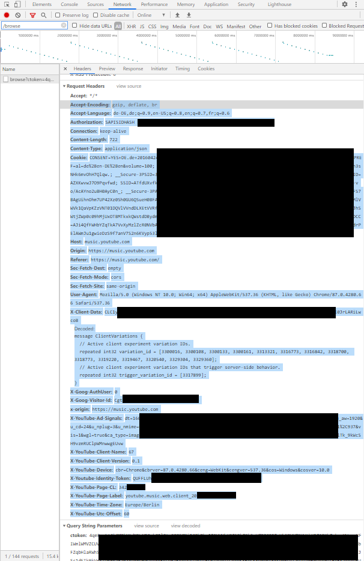

# yTube Music Player

Adds a mediaplayer to Home Assistant that can stream tracks from your YouTube music premium subscription to a media player.

**This component will set up the following platforms.**

Platform | Description
-- | --
`media_player` | will allow to play music from your YouTube Music account


With mini-media-player (https://github.com/kalkih/mini-media-player) 

Also supports media_browser


## Features
- loads all your playlists from your YouTube Music account
- can either play straight from the playlist or create a radio based on the playlist
- extracts url of the stream and forwards it to a generic mediaplayer
- keeps auto_playing as long as it is turned on
- on the fly change of media_player (playlist will stay the same, and position in track will be submitted to next player)
- some proxy funcationality to support sonos player (currently testing_state)

# Installation

## HACS

The easiest way to add this to your Home Assistant installation is using [HACS](https://hacs.xyz/docs/basic/getting_started).

To configure a new Custom Repository in HACS, click on the three dots at the top right and select `Custom repositories`. Once you have the custom repository menu open, paste the GitHub URL `https://github.com/KoljaWindeler/ytube_music_player/`, select `Integration`, hit `ADD`.

It's recommended to restart Home Assistant directly after the installation without any change to the Configuration.
Home Assistant will install the dependencies during the next reboot. After that you can add and check the configuration without error messages.
This is nothing special to this Integration but the same for all custom components.

## Manual

1. Using the tool of choice open the directory (folder) for your HA configuration (where you find `configuration.yaml`).
2. If you do not have a `custom_components` directory (folder) there, you need to create it.
3. In the `custom_components` directory (folder) create a new folder called `ytube_music_player`.
4. Download _all_ the files from the `custom_components/ytube_music_player/` directory (folder) in this repository.
5. Place the files you downloaded in the new directory (folder) you created.

Using your HA configuration directory (folder) as a starting point you should now also have this:

```text
custom_components/ytube_music_player/translations/en.json
custom_components/ytube_music_player/__init__.py
custom_components/ytube_music_player/browse_media.py
custom_components/ytube_music_player/manifest.json
custom_components/ytube_music_player/media_player.py
custom_components/ytube_music_player/config_flow.py
custom_components/ytube_music_player/const.py
```

# Setup

You need to grab and convert a cookie from youTube Music. This is described in https://ytmusicapi.readthedocs.io/en/latest/setup.html#copy-authentication-headers

**1. Basic steps for grabbing**

1. Open the development tools (I've used google chrome) [Crtl+Shift+I]
2. Open the Network tab
3. Open https://music.youtube.com, log out, log in, browse a bit around like clicking on the library in the top menu
4. Search for "/browse" (for me only one item shows up) [If you can't find it: I had issues with ubuntu, worked instantly with windows]
5. Go to "headers" -> "request headers" and copy everything starting after the "accept: */*" (mark with a mouse and copy to clipboard)

It should look like the screenshot below



**2. Please use the config flow of Home Assistant**

1. Open Configuration -> Integrations -> "add integration" -> "YouTube Music Player"
1.1. If the integration didn't show up in the list please REFRESH the page
2. Paste the cookie into the indicated field, all other fields are optional
3. It is highly recommended to enter the entity_id of your default ouput player, otherwise you have to set that after every reboot
4. The second page shows several entity_ids for dropdown field. You can leave the default values, even if you don't want to use those field and don't add them to your configuration... or clear the field ... both will work fine

**Although YAML configuration is still possible: Please remove it and configure the player via config_flow or several functions will be missing**

## Shortcuts
The screenshot below shows the mini-media-player from kalkih (https://github.com/kalkih/mini-media-player)


This mediaplayer offers shotcuts, which can be used to select a remote_player and playlist with a single click:

```
- type: 'custom:mini-media-player'
  entity: media_player.ytube_music_player
  artwork: cover
  hide:
    shuffle: false
    icon_state: false
  shortcuts:
    columns: 3
    buttons:
      - name: Badezimmer
        type: source
        id: badezimmer
      - name: Keller
        type: source
        id: keller
      - name: Laptop
        type: source
        id: bm_8e5f874f_8dfcb60f
      - name: My Likes
        type: channel
        id: PLZvjm51R8SGuxxxxxxx-A17Kp3jZfg6pg
      - name: Lala
        type: playlist
        id: PLZvjm51R8SGuxxxxxxx-A17Kp3jZfg6pg
```

## Services
The following commands are available:
mini-media-player shortcut type | service call | details
-- | -- | --
`source` | **media_player.select_source** *source=id and entity_id=[this]* | selects the media_player that plays the music. id can be an entity_id like `media_player.speaker123` or just the name `speaker123`
`playlist` | media_player.play_media | plays a playlist from YouTube. *You can get the playlist Id from the Youtube Music website. Open a playlist from the library and copy the id from the link e.g. https://music.youtube.com/playlist?list=PL6H6TfFpYvpersxxxxxxxxxaPueTqieF*
`channel` | media_player.play_media | selects one track from a **playlist** and starts a radio based on that track. So the id has to be a **playlist_id**
`album` | media_player.play_media | plays an album. *You can  get the album Id from the Youtube Music website. Open an album from the library https://music.youtube.com/library/albums and copy the Id from the links*
`track` | media_player.play_media | will play only one dedicated track
`history` | media_player.play_media | will play a playlist from your recent listen music **on the website or the app** *the music that you play with this component will not show up in the list*
`user_tracks` | media_player.play_media | this type will play the **uploaded** tracks of a user
`user_album` | media_player.play_media | **uploaded** album of a user
`user_artist` | media_player.play_media | play all **uploaded** tracks of an artists

All calls to *media_player.play_media* need three arguments: media_content_id is the equivalent of the shortcut id, media_content_type represents the type (e.g. album) and the entity_id is always media_player.ytube_music_player

You can also select the music you want to listen to via the media_browser and look up the media_content_type and media_content_id in the attributs of the player.

In addition the following special commands are also available:
Service | parameter | details
-- | -- | --
`ytube_music_player.call_method` | `entity_id`: media_player.ytube_media_player, `command`: rate_track, `parameters`: thumb_up / thumb_down / thumb_middle / thumb_toggle_up_middle | Rates the currently playing song. The current rating is available as 'likeStatus' attribute of the player entity_id. middle means that the rating will be 'indifferent' so basically removes your previous rating
`ytube_music_player.call_method` | `entity_id`: media_player.ytube_media_player, `command`: reload_dropdowns | Reloads the dropdown list of all media_players and also the playlists. Might be nice to reload those lists without reboot HA
`ytube_music_player.call_method` | `entity_id`: media_player.ytube_media_player, `command`: interrupt_start | Special animal 1/2: This will stop the current track, but note the position in the track. It will also store the track number in the playlist and the playlist. Finally it will UNTRACK the media_player. As result you can e.g. play another sound on that player, like a door bell or a warning
`ytube_music_player.call_method` | `entity_id`: media_player.ytube_media_player, `command`: interrupt_resume | Special animal 2/2: This is the 2nd part and will resume the playback

## Dropdowns, Buttons and Marksdowns
**TBD**
The player attributes contain addition informations, like the playlist and if available the lyrics of the track

The yaml setup is available at package/markdown.yaml

## Automations
Play my **favorite** playlist in **random** mode on my **kitchen** speaker (kuche)
```yaml
alias: ytube morning routine
sequence:
  - service: media_player.select_source
    data:
      source: kuche
      entity_id: media_player.ytube_music_player
  - service: media_player.shuffle_set
    data:
      shuffle: true
      entity_id: media_player.ytube_music_player
  - service: media_player.play_media
    data:
      entity_id: media_player.ytube_music_player
      media_content_id: PL6H6TfFpYvpersEdHECeWkocaPueTqieF
      media_content_type: playlist
mode: single
```
Interrupt current playback, play a "DingDong" and resume playback
```yaml
alias: dingdong
sequence:
  - service: ytube_music_player.call_method
    entity_id: media_player.ytube_music_player
    data:
      command: interrupt_start
  - variables:
      vol: '{{ state_attr("media_player.keller_2", "volume_level") }}'
  - service: media_player.volume_set
    entity_id: media_player.keller_2
    data:
      volume_level: 1
  - service: media_player.play_media
    entity_id: media_player.keller_2
    data:
      media_content_id: 'http://192.168.2.84:8123/local/dingdong.mp3'
      media_content_type: music
  - delay: '00:00:02'
  - service: media_player.volume_set
    entity_id: media_player.keller_2
    data:
      volume_level: 0
  - service: ytube_music_player.call_method
    entity_id: media_player.ytube_music_player
    data:
      command: interrupt_resume
  - service: media_player.volume_set
    entity_id: media_player.keller_2
    data:
      volume_level: '{{vol}}'
mode: single

```

## Debug Information
I've added extensive debugging information to the component. So if you hit an error, please see if you can get as many details as possible for the issue by enabling the debug-log-level for the component. This will produce quite a lot extra informations in the log (configuration -> logs). Please keep in mind that a restart of Homeassistant is needed to apply this change. 
```yaml
logger:
  default: info
  logs:
    custom_components.ytube_music_player: debug
```


## Multiple accounts
Not yet tested, but should work in general. Please create two entities via the Config_flow and use **different** paths for the header file

## Credits

This is based on the gmusic mediaplayer of tprelog (https://github.com/tprelog/HomeAssistant-gmusic_player), ytmusicapi (https://github.com/sigma67/ytmusicapi) and pytube (https://github.com/nficano/pytube). This project is not supported nor endorsed by Google. Its aim is not the abuse of the service but the one to improve the access to it. The maintainers are not responsible for misuse.
